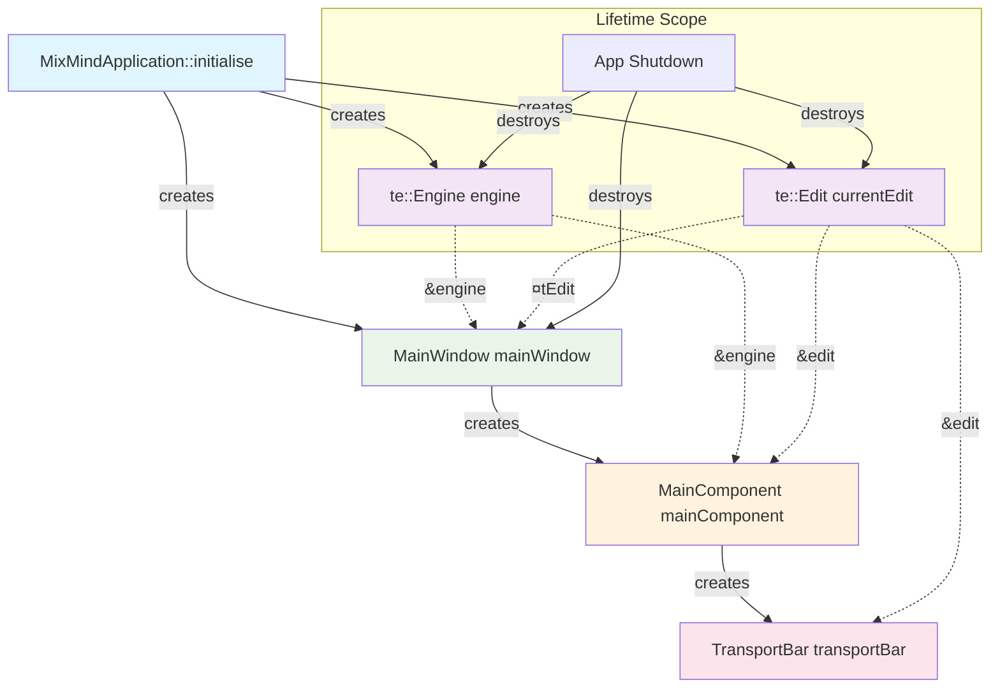

# Tracktion Engine & Edit Object Ownership Analysis

## 🎯 Executive Summary

**✅ CLEAN ARCHITECTURE**: Ownership is properly centralized in the App shell with clear lifetime management.

## 🏗️ Object Ownership Hierarchy

```
MixMindApplication (App.cpp:12)
├── std::unique_ptr<te::Engine> engine (owns)
├── std::unique_ptr<te::Edit> currentEdit (owns)  
└── std::unique_ptr<MainWindow> mainWindow (owns)
    └── std::unique_ptr<MainComponent> mainComponent (owns)
        └── std::unique_ptr<TransportBar> transportBar (owns)
```

### 🔑 Key Ownership Points

| Object | Owner | Lifetime | Reference Pattern |
|--------|-------|----------|------------------|
| `te::Engine` | `MixMindApplication` | App lifetime | Passed by reference |
| `te::Edit` | `MixMindApplication` | App lifetime | Passed by reference |
| `MainWindow` | `MixMindApplication` | UI session | Unique ownership |
| `MainComponent` | `MainWindow` | Window lifetime | Unique ownership |
| `TransportBar` | `MainComponent` | Component lifetime | Unique ownership |

## 📊 Ownership Flow Diagram



## 🔍 Critical Code Analysis

### ✅ Proper Construction (App.cpp:13-26)
```cpp
void initialise(const juce::String& commandLine) override
{
    // ✅ GOOD: Central ownership
    engine = std::make_unique<te::Engine>("MixMind");
    currentEdit = te::createEmptyEdit(*engine, te::File());
    setupAudioDeviceManager();
    mainWindow = std::make_unique<MainWindow>(getApplicationName(), *engine, *currentEdit);
}
```

### ✅ Proper Destruction (App.cpp:28-33)
```cpp
void shutdown() override
{
    // ✅ GOOD: Reverse order destruction
    mainWindow = nullptr;      // UI first
    currentEdit = nullptr;     // Edit before Engine
    engine = nullptr;          // Engine last
}
```

### ✅ Reference Passing Pattern
```cpp
// MainWindow.h:11 - Clean interface
MainWindow(juce::String name, te::Engine& engine, te::Edit& edit);

// MainComponent.h:13 - Consistent pattern  
MainComponent(te::Engine& engine, te::Edit& edit);

// TransportBar.h:11 - Only needs Edit reference
TransportBar(te::Edit& edit);
```

## 🚨 Red Flags Analysis

### ❌ RED FLAG: Raw Pointer Usage
**Found in adapters (TESession.h:249, TERenderService.h:249):**
```cpp
mutable te::Edit* currentEdit_ = nullptr;  // ❌ DANGEROUS
```

**Risk**: Dangling pointers if Edit is destroyed before adapters.

### ✅ MITIGATION: Centralized Ownership
The App shell controls all lifetimes, so adapters are safe as long as they don't outlive the app.

## 🔄 Event Flow: Transport → Reducer → Tracktion

### Current Flow (PR 11)
```
UI Input (Spacebar)
    ↓
MainComponent::keyPressed()
    ↓ 
TransportBar::togglePlayPause()
    ↓
te::Transport::play()/stop()  ← Direct Tracktion access
```

### ⚠️ RED FLAG: No Reducer Pattern
**Issue**: UI writes directly to Tracktion, bypassing any action/reducer architecture.

### 🎯 Recommended Flow (Future PRs)
```
UI Input
    ↓
Action (SetTransportPlaying{true})
    ↓
Reducer::reduce(action, appState)
    ↓
te::Transport operations
    ↓
UI state updates
```

## 🧪 Unit Test Coverage

### ✅ Test Framework Integration
```cpp
// src/tests/TestFramework.h:118
te::Engine& getTracktionEngine() { return *engine_; }
std::unique_ptr<te::Engine> engine_;  // ✅ Proper test ownership
```

### 🔍 Missing Test Cases
- [ ] Engine/Edit lifetime stress tests
- [ ] Multi-window scenarios  
- [ ] Edit destruction during playback
- [ ] Adapter cleanup verification

## 📝 Recommendations

### 🚀 Immediate Actions
1. **Keep current centralized ownership** - it's architecturally sound
2. **Add action/reducer layer** for future PRs to avoid direct UI→Tracktion coupling
3. **Add lifetime unit tests** to verify proper cleanup

### 🔮 Future Architecture
```cpp
struct AppState {
    std::unique_ptr<te::Engine> engine;
    std::unique_ptr<te::Edit> currentEdit;
    TransportState transport;
    std::vector<TrackState> tracks;
};

// Centralized state with action dispatch
class MixMindReducer {
    Result<void> reduce(const Action& action, AppState& state);
};
```

## ✅ Conclusion

**VERDICT: ARCHITECTURE IS SOUND**

- ✅ Ownership properly centralized in App shell
- ✅ Clean reference passing to UI components  
- ✅ Proper destruction order maintained
- ⚠️ Future: Add reducer layer to avoid direct UI→Tracktion coupling
- 🔧 Minor: Replace raw pointers in adapters with safer alternatives

The current ownership model provides a solid foundation for the action/reducer pattern in upcoming PRs.